## GO HEELS


# Background


## Goals

\Large

>- \faCogs \vspace{.5cm} easy to implement

>- \faExclamationTriangle \vspace{.5cm} minimizes errors

>- \faCommentsO \vspace{.5cm} collaborators can understand & contribute

## Background

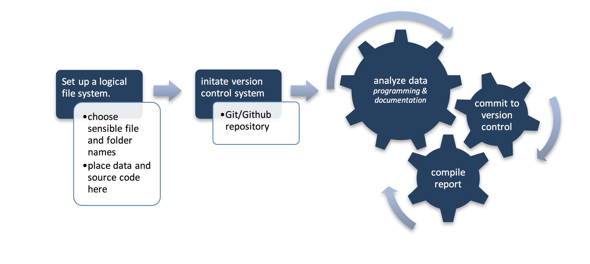

## Definitions

`shell`: This can be referred to as the terminal, bash, Command Prompt, etc. We will be navigating to different folders and running commands here.

## Definitions

`chunk`: A section of a programming language, in this case `SAS` or `R`.

## Definitions

`Git`: A version control system for tracking file changes 

`GitHub`: Web based Git repository 


## Definitions
\LaTeX: A type-setting system designed for scientific documentation. *Pronounced lah-tek*

# Best Practices

## File Organization

Consistent file organization is key. I prefer the following setup:
\faFolderOpenO project-name  
$\Rdsh$\faFolderOpenO code  
$\Rdsh$\faFolderOpenO data  
$\Rdsh$\faFolderOpenO reports

## File Organization

>- \faLongArrowDown \vspace{.5cm} All lower case 
>- \faTable \vspace{.5cm} Separated by underscores (_) for field separation and dashes (-) for term/word separation (*for example, 2017-01-01_new-years-resolutions*).
>- \faCalendarCheckO  \vspace{.5cm} If including a date, begin file name with YYYY-MM-DD (*this ensures easy sorting*)
>- \faExclamationTriangle \vspace{.5cm} Avoid things like analysis_final_final_this-is-really-final_2.tex 

## Version Control

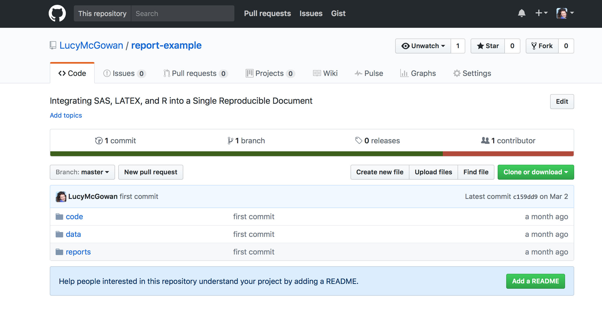

## Version Control

### Motivation

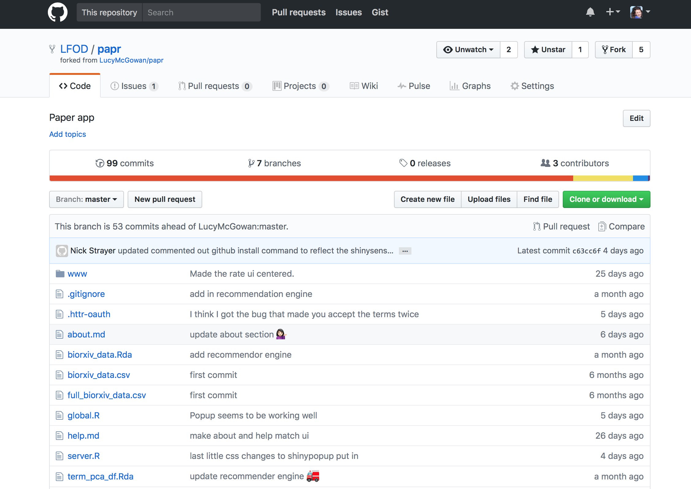

## Version Control

### Motivation
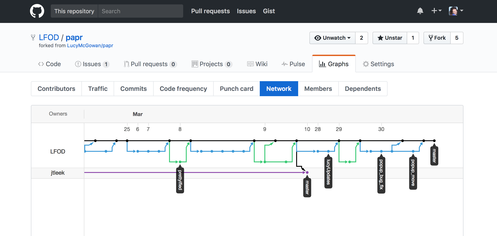


## Version Control

### GitHub

>0.	If you do not have a GitHub account, you can create one (github.com). If you do not have Git installed, install it. 

>1.	Log into your GitHub account and create a repository with the same name as the parent directory.

>2.	In the shell, navigate to your project-name folder and type (or copy and paste) the following, changing your-user-name to your GitHub username and project-name to your project name 

## Version Control


## Version Control


```{bash, eval = FALSE}
git init
git add .
git commit –m “first commit”
git remote add origin 
    https://github.com/your-user-name/project-name.git
git push -u origin master
```

## Version Control


Every time you make a change to a file, repeat the following commands in the shell

```{bash, eval = FALSE}
git add filename
git commit –m “describe your file change here”
git push -u origin master
```

## Version Control


## Version Control

### GitHub Resources

1. Hu, J. (2013). The Hitchhiker’s Guide to Github: SAS Programming Goes Social. SESUG. URL http://analytics.ncsu.edu/sesug/2013/PA-04.pdf.

2. Philp, S. (2012). An Introduction to Git Version Control for SAS Programmers. WUSS. URL http://www.wuss.org/proceedings12/94.pdf. 

3. Bryan, J. (2017). Happy Git and GitHub for the useR. URL http://happygitwithr.com/ 

## Literate Programming 


```{r fig.width=10, fig.height=10,echo=FALSE}
library(png)
library(grid)
img <- readPNG("img/donald_knuth.png")
 grid.raster(img)
```
<!--  -->

## Literate Programming

> “I believe that the time is ripe for significantly better documentation of programs, and that we can best achieve this by considering programs to be works of literature. Hence, my title: “Literate Programming.” 
Let us change our traditional attitude to the construction of programs: Instead of imagining that our main task is to instruct a computer what to do, let us concentrate rather on explaining to human beings what we want a computer to do.” (Knuth 1984).

## Literate Programming

\centering
\Huge
explanation + `code`

# Setup

## Setup

\Large

- \faPencilSquareO \vspace{.5cm} \LaTeX

- \faMortarBoard \vspace{.5cm} SAS University Edition

- \faPuzzlePiece \vspace{.5cm} R

## \LaTeX

\Large 

>- pdflatex (version 1.3 or later)

>- StatRep 

## \LaTeX

### StatRep

>- \faGroup \vspace{.5cm} open-source software project 

>- \faPaperPlaneO \vspace{.5cm} reads the code and markup & creates a SAS program

>- \faFileO \vspace{.5cm}  results that are displayed in your document

## \LaTeX

### StatRep

http://support.sas.com/rnd/app/papers/statrep.html

>1.	Copy the StatRep macros to a local directory. *Remember where you are saving these macros, you will need this filepath soon.*

>2.	Install the LATEX package 


## SAS University Edition

>1. Install https://www.sas.com/en_us/software/university-edition.html

>2.	Create a folder with the title of your project, mine will be called report-example  

>3.	Within that folder create 3 folders: **data**, **code**, **reports**  

>4. Add project folder to SAS University Edition

>5. Add macro folder to SAS University Edition

## SAS University Edition

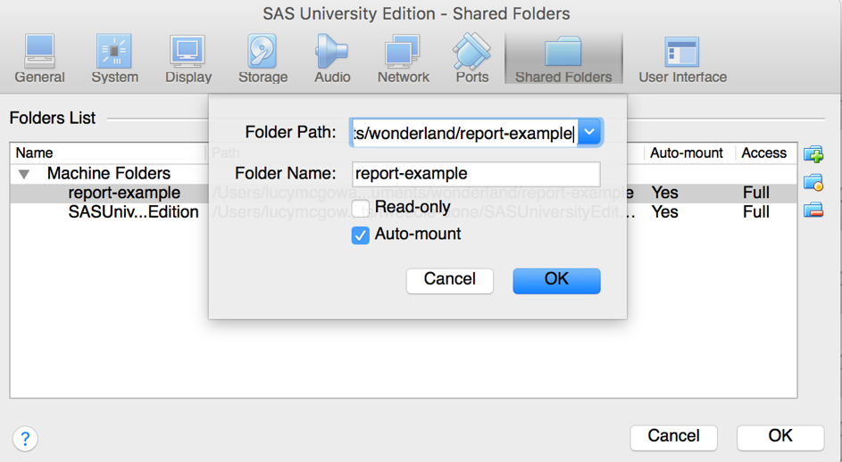

## SAS University Edition

\centering
\Large
`/folders/myshortcuts/report-example/`

## R

1. Download R (https://www.r-project.org)

2. Install the `knitr` package:

```{r, eval = FALSE}
install.packages(‘knitr’)
```


# Methods

## Methods

> 1. Document Setup

> 2. Programming and Documentation

> 3. Rendering


## Document Setup

\centering
\Huge

\faSave \vspace{.5cm} `analysis.Rnw`

## Document Setup

```
\documentclass{article}
\usepackage{statrep}
\usepackage{parskip,xspace,hyperref}
\def\SRrootdir{/folders/myshortcuts/report-example/code}
\def\SRmacropath{/folders/myshortcuts/statrep_macros.sas}
\title{Your title}
\author{Your name}
\date{\today}
\begin{document}
\maketitle

[we will add code here]

\end{document}
```
## Recap

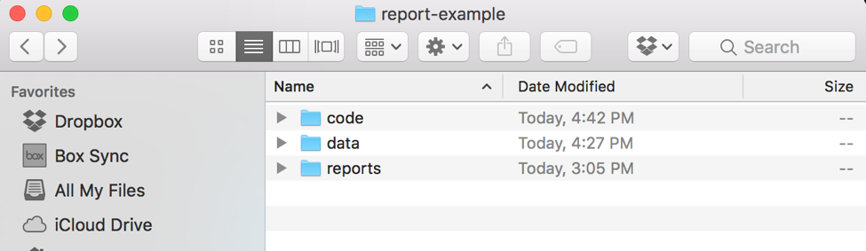

## Recap

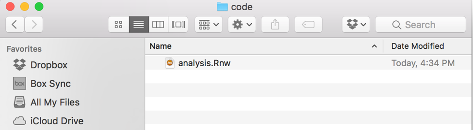

## Recap 

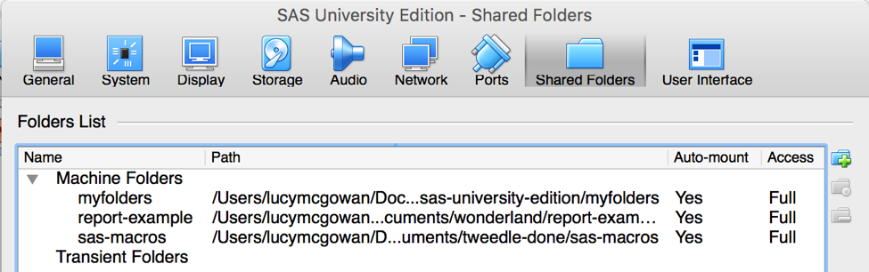

## Programming and Documentation

\centering
\Huge
\faDatabase \vspace{.5cm} data

## Programming and Documentation

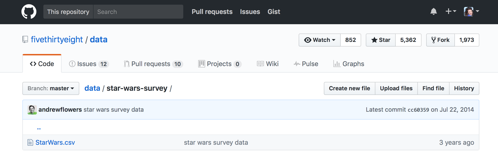

## Programming and Documentation

\centering 
\Large
\faTrash \vspace{.5cm} `[we will add code here]`

## Programming and Documentation

### SAS Chunk

```{sas, eval = FALSE}
\begin{Sascode}

/* SAS CODE HERE */

\end{Sascode}

```

## Programming and Documentation

### R Chunk

```
<<>>=

#R CODE HERE

@
```
## Programming and Documentation


## Programming and Documentation


## Programming and Documentation

### Importing
```
I obtained data from a 538 Star Wars Survey 
and will read it into SAS in order to analyze whether
age, gender, education level, or whether the individual
is a Star Trek fan are associated with incorrectly 
believing that Greedo shot first.

\begin{Sascode}
libname data "/folders/myshortcuts/report-example/data";

filename reffile 
   '/folders/myshortcuts/report-example/data/data.csv';
```

## Programming and Documentation
###Importing
```
proc import datafile=reffile
	dbms=csv
	out=data.starwars;
	getnames=yes;
run;
\end{Sascode} 
```

## Programming and Documentation
### Modeling

```
\begin{Sascode}[store = logistic]
ods graphics on;

proc logistic data = data plots = oddsratio;
 class age (ref = FIRST) gender college star_trek_fan;
 model wrong (event = "1") = age gender college 
    star_trek_fan;
run;

ods graphics off;
\end{Sascode}
```

## Programming and Documentation
### Results

```
\Listing[store = logistic,
objects = OddsRatios,
caption = {Wrong about who shot first OR}]{logisticOR}
```
## Programming and Documentation

### Results

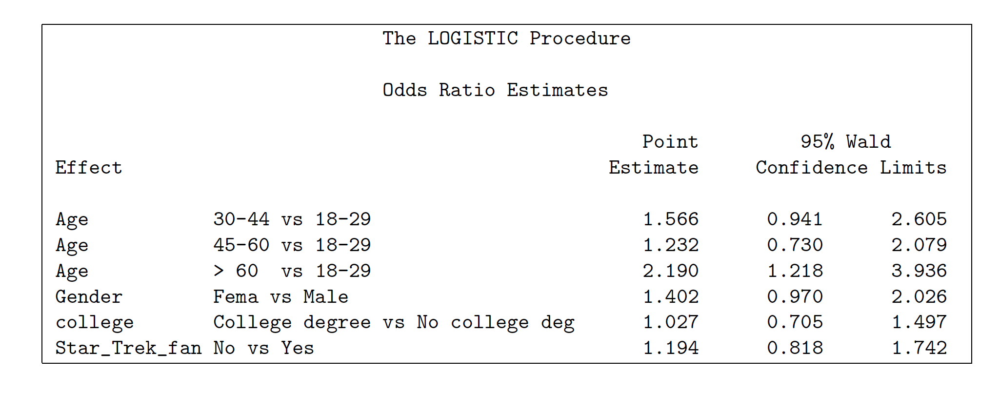

## Programming and Documentation

### Results

```
\Graphic[store=logistic,
   objects=ORPlot,
   caption={Wrong about who shot first plots}]{ORplot}
```

## Programming and Documentation

### Results

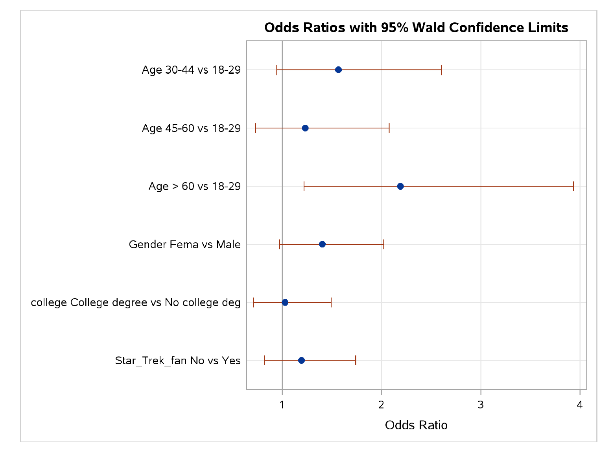

## Programming and Documentation
### Export

```
\begin{Sascode}
proc export data=data.starwars
   outfile =
     '/folders/myshortcuts/report-example/data/data_.csv'
   replace
   dbms = dlm;
   delimiter = ',';
run;
\end{Sascode}
```

## Programming and Documentation

### R Code
```{r, eval = FALSE}
<<>>=
filename = "../data/starwars_sasedit.csv"
if (file.exists(filename)){

starwars <- read.csv(filename)

# more R code here
}
@
```

## Programming and Documentation

### R
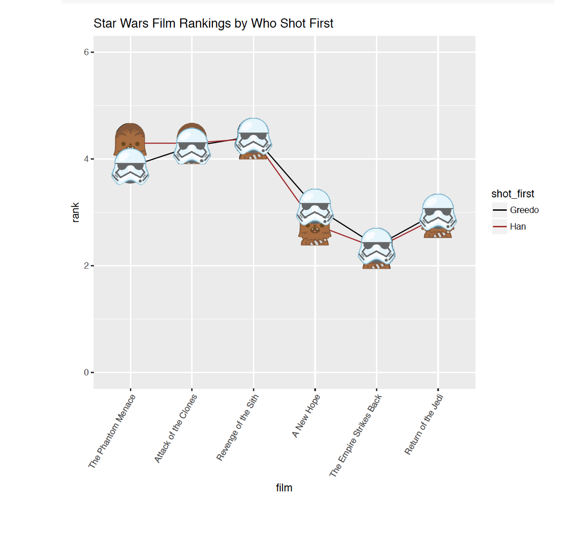

## Rendering

> 1.	Compile the `.Rnw` file. This is completed using knitr. In the shell, navigate to your code folder where analysis.Rnw is located and submit:
 `RScript -e "library(knitr); knit('analysis.Rnw')"`

> 2.	Compile the pdflatex. Run the following in the shell:
`pdflatex analysis.tex`

> 3.	Run the SAS code. Open SAS University Edition. Navigate to your code folder (it will be under Server Files and Folders). Open and run analysis_SR.sas.

> 4.	Re-compile the pdflatex. Run the following in the `shell`:
`pdflatex analysis.tex`


## References
1. Arnold, T., & Kuhfeld, W. F. (2012). Using SAS and LATEX to Create Documents with Reproducible Results. URL http://support.sas.com/resources/papers/proceedings12/324-2012.pdf.
2. Arnold, T. (2015). The StatRep System for Reproducible Research: A Note for SAS University Edition Users. URL http://support.sas.com/rnd/app/papers/statrep/statrepUE.pdf.
3. Bryan, J. (2017). Happy Git and GitHub for the useR. URL http://happygitwithr.com/ 
4. FiveThirtyEight. (2014). America’s Favorite ‘Star Wars’ Movies (And Least Favorite Characters). URL https://fivethirtyeight.com/datalab/americas-favorite-star-wars-movies-and-least-favorite-characters/. Data found at: https://github.com/fivethirtyeight/data/tree/master/star-wars-survey

## References
5. Hu, J. (2013). The Hitchhiker’s Guide to Github: SAS Programming Goes Social. SESUG. URL http://analytics.ncsu.edu/sesug/2013/PA-04.pdf.
6. Knuth, D. E. (1984). Literate programming. The Computer Journal, 27(2), 97-111.
7. Philp, S. (2012). An Introduction to Git Version Control for SAS Programmers. WUSS. URL http://www.wuss.org/proceedings12/94.pdf. 
8. Wickham, H. (2015). R packages. O'Reilly Media, Inc.

## Contact

Lucy D’Agostino McGowan  
Vanderbilt University  
\faEnvelopeO \vspace{.5cm} ld.mcgowan@vanderbilt.edu  
\faGlobe \vspace{.5cm} www.lucymcgowan.com  
\faGithub \vspace{.5cm} LucyMcGowan  
\faTwitter \vspace{.5cm}  @LucyStats   


