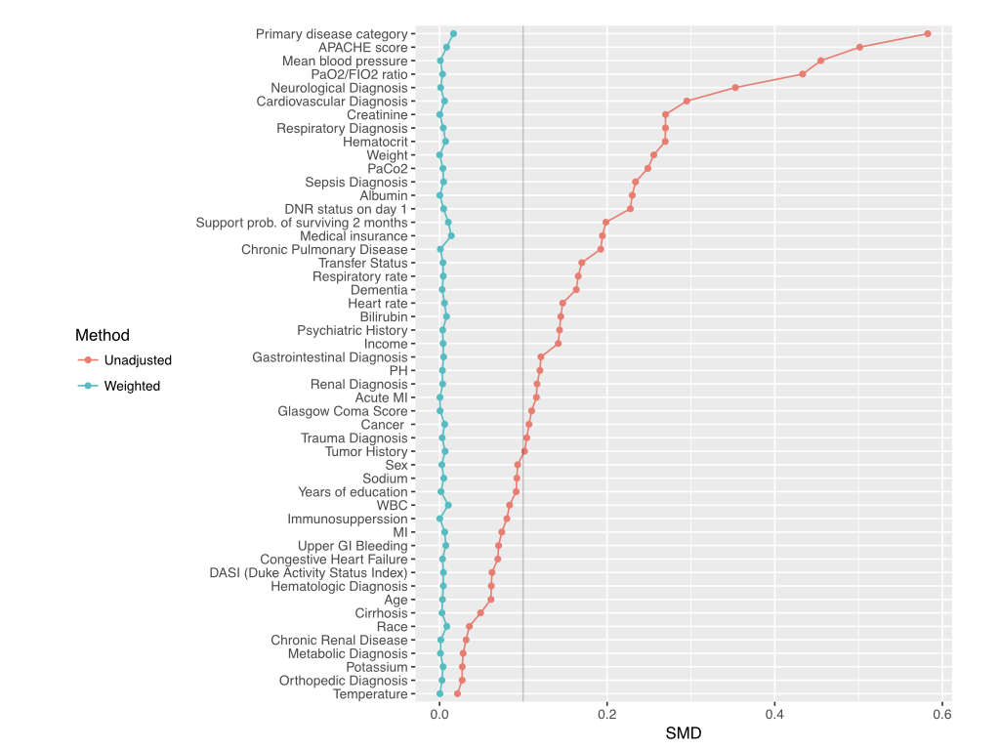
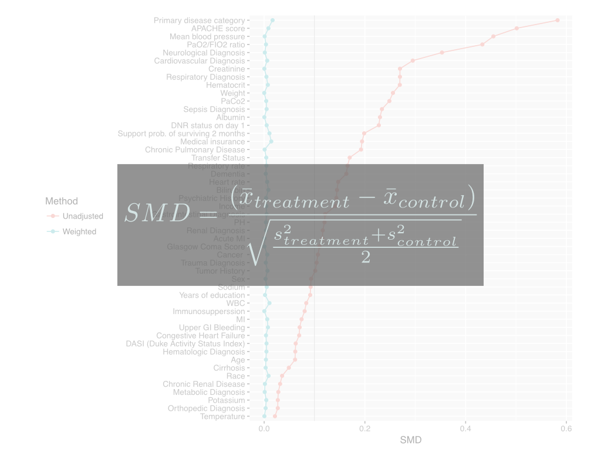
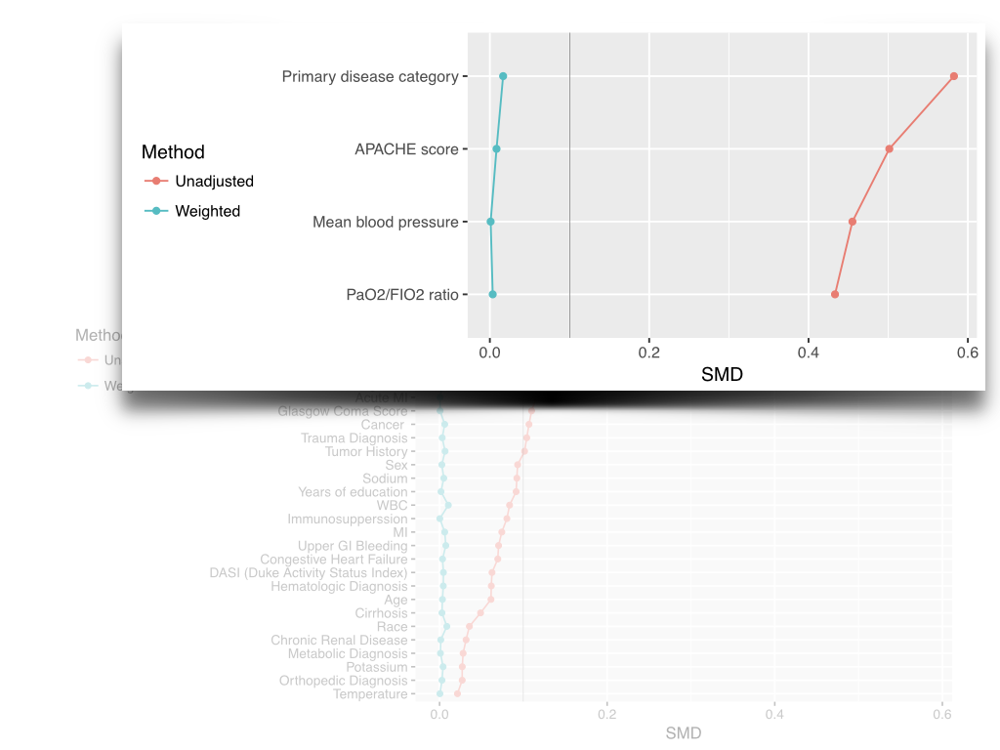

---
output:
  xaringan::moon_reader:
    lib_dir: libs
    nature:
      highlightLines: true
    self_contained: true
    css: my_style.css
    chakra: libs/remark-latest.min.js
---

```{r setup, include=FALSE}
options(htmltools.dir.version = FALSE)
htmltools::tagList(rmarkdown::html_dependency_font_awesome())
```
class: center, middle 
# Contextualizing Sensitivity Analysis in Observational Studies

Lucy D'Agostino McGowan  
Robert A Greevy, Jr

---
layout: true

.footnote[\#JSM2017]
---

## recommended steps

<span class="fa-stack fa-lg">
  <i class="fa fa-circle fa-stack-2x"></i>
  <i class="fa fa-line-chart fa-stack-1x fa-inverse"></i>
</span> State the primary analysis result

<span class="fa-stack fa-lg">
  <i class="fa fa-circle fa-stack-2x"></i>
  <i class="fa fa-anchor fa-stack-1x fa-inverse"></i>
</span> Anchor a sensitivity analysis with your data

<span class="fa-stack fa-lg">
  <i class="fa fa-circle fa-stack-2x"></i>
  <i class="fa fa-balance-scale fa-stack-1x fa-inverse"></i>
</span> Calculate a hypothetical "**tipping point**" confounder

---

## recommended steps
<span class="fa-stack fa-lg">
  <i class="fa fa-circle fa-stack-2x fa-inverse-2"></i>
  <i class="fa fa-line-chart fa-stack-1x fa-inverse"></i>
</span> State the primary analysis result

<span class="fa-stack fa-lg">
  <i class="fa fa-circle fa-stack-2x"></i>
  <i class="fa fa-anchor fa-stack-1x fa-inverse"></i>
</span> Anchor a sensitivity analysis with your data

<span class="fa-stack fa-lg">
  <i class="fa fa-circle fa-stack-2x fa-inverse-2"></i>
  <i class="fa fa-balance-scale fa-stack-1x fa-inverse"></i>
</span> Calculate a hypothetical "**tipping point**" confounder

---

## recommended steps
<span class="fa-stack fa-lg">
  <i class="fa fa-circle fa-stack-2x fa-inverse-2"></i>
  <i class="fa fa-line-chart fa-stack-1x fa-inverse"></i>
</span> State the primary analysis result

<span class="fa-stack fa-lg">
  <i class="fa fa-circle fa-stack-2x fa-inverse-2"></i>
  <i class="fa fa-anchor fa-stack-1x fa-inverse"></i>
</span> Anchor a sensitivity analysis with your data

<span class="fa-stack fa-lg">
  <i class="fa fa-circle fa-stack-2x"></i>
  <i class="fa fa-balance-scale fa-stack-1x fa-inverse"></i>
</span> Calculate a hypothetical "**tipping point**" confounder

---

## recommended steps
<span class="fa-stack fa-lg">
  <i class="fa fa-circle fa-stack-2x fa-inverse-2"></i>
  <i class="fa fa-line-chart fa-stack-1x fa-inverse"></i>
</span> State the primary analysis result

<span class="fa-stack fa-lg">
  <i class="fa fa-circle fa-stack-2x fa-inverse-2"></i>
  <i class="fa fa-anchor fa-stack-1x fa-inverse"></i>
</span> Anchor a sensitivity analysis with your data

<span class="fa-stack fa-lg">
  <i class="fa fa-circle fa-stack-2x"></i>
  <i class="fa fa-balance-scale fa-stack-1x fa-inverse"></i>
</span> Calculate a hypothetical "**tipping point**" confounder

```r
devtools::install_github("LucyMcGowan/tipr")
tip_with_binary(p1 = .5, p0 = 0, lb = 1.2, ub = 1.5)
```
---

## anchor your sensitivity analysis

<span class="fa-stack fa-lg">
  <i class="fa fa-circle fa-stack-2x"></i>
  <i class="fa fa-eye fa-stack-1x fa-inverse"></i>
</span>  Visualize bias

<span class="fa-stack fa-lg">
  <i class="fa fa-circle fa-stack-2x"></i>
  <i class="fa fa-user-md fa-stack-1x fa-inverse"></i>
</span> Use content-matter expertise


<span class="fa-stack fa-lg">
  <i class="fa fa-circle fa-stack-2x"></i>
  <i class="fa fa-check fa-stack-1x fa-inverse"></i>
</span>  Make an data-driven decision

---

---

---

---

---

---
layout: true
---

## Lucy D'Agostino McGowan
<span class="fa-stack fa-lg">
  <i class="fa fa-circle fa-stack-2x"></i>
  <i class="fa fa-question fa-stack-1x fa-inverse"></i>
</span> <b>Poster #34 Baltimore Convention Center Halls A&B 10:30a</b>

 <i class="fa fa-cog fa-spin fa-2x fa-fw"></i>
 [http://rpubs.com/lucymcgowan/jsm2017_poster](http://rpubs.com/lucymcgowan/jsm2017_poster)

<span class="fa-stack fa-lg">
  <i class="fa fa-circle fa-stack-2x"></i>
  <i class="fa fa-toggle-right fa-stack-1x fa-inverse"></i>
</span> [http://rpubs.com/lucymcgowan/jsm2017](http://rpubs.com/lucymcgowan/jsm2017)

<span class="fa-stack fa-lg">
  <i class="fa fa-circle fa-stack-2x"></i>
  <i class="fa fa-twitter fa-stack-1x fa-inverse"></i>
</span>
[@LucyStats](https://twitter.com/LucyStats)

.footnote[Slides created via the R package [**xaringan**](https://github.com/yihui/xaringan).]
