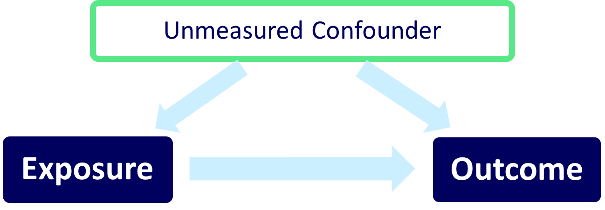
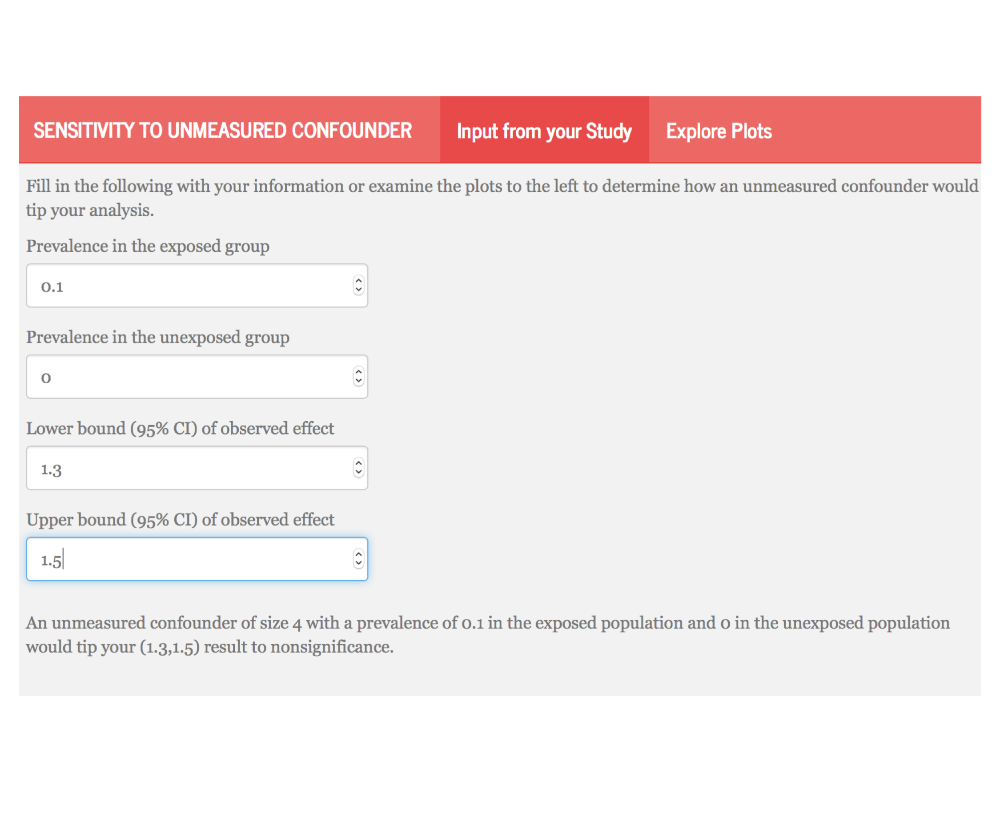
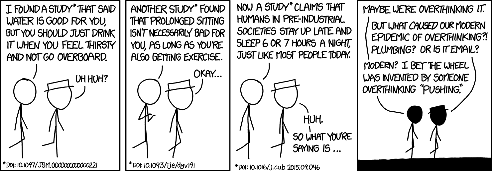

```{r setup, include=FALSE}
options(htmltools.dir.version = FALSE)
library("ggplot2")
```

# Background

--

<center>
 </img>
</center>

--

- a review of **90 observational studies** with statistically significant findings published in 2015 in

  - JAMA
  - NEJM
  - AJE

--

- 41 (45.6%) **mentioned the issue** of unmeasured confounding as a limitation  

--

- 4 (4.4%) **included a quantitative sensitivity analysis**

---
class: middle

## "In a study with binary outcomes and binary exposures the relative risk may be off by a factor of 2, but unlikely to be off more than that." 
*van Belle, G. (2011). Statistical Rules of Thumb. Wiley.*

---
class: center, middle
# Adventure is out there!


---

class: center, middle


---

class: middle
<table cellpadding="10">
  <tbody>
    <tr>
<td>
<h4>"If cigarette smokers have 9 times the risk of nonsmokers for developing lung cancer, and this is not because cigarette smoke is a causal agent, but only because cigarette smokers produce hormone X, then the proportion of hormone-X-producers among cigarette smokers must be at least 9 times greater than that of nonsmokers..."</h4><br>
<i>Cornfield et al. (1959)</i>
</td><td>
 
<i> Fisher 1956.</td></tr></tbody></table>
---
class: center, middle


---
class: center, middle


---
class: center, middle


---
class: center, middle


---
class: center, middle


---
class: center, middle


---

class: center, middle


---
# Tipping point analysis

- interested in which values of an unmeasured confounder would cause the lower or upper confidence interval of the association measure to cross 1

--

- assuming the senstivity parameters are fixed, we can extend these methods to confidence bounds

---

class: middle
## "in order for our association to no longer be significant, there would need to exist an unmeasured confounder of size $\Gamma$ that is prevalent in $p_1$ of the exposed population and $p_0$ of the unexposed population."
---
class: center, middle

# $\Gamma(LB, p_0, p_1) = \frac{(1-p_1)+LB(p_0-1)}{LBp_0-p_1}$
---

# Write-up

These methods can easily be incorporated in any study using the following formula:
--

1. State the primary analysis result

--

2. State the size and prevalence of a hypothetical "tipping point" confounder

--

3. Anchor this in an example from your study
---

<!-- # Example -->

<!-- - retrospective cohort using national Veterans Health Administration (VHA) databases  -->

<!-- -- -->

<!-- - comparing heart failure among patients initiating two diabetes drugs, metformin or sulfonylurea. -->

<!-- -- -->

<!-- - each patient initiated on metformin was propensity score-matched to a patient initiated on sulfonylurea -->
<!-- --- -->
# State the primary analysis results

### The primary analysis yielded a greater risk of heart failure with sulfonylurea use over metformin use; HR (95% CI): 1.40 (1.30, 1.50). 

---
# State a size and prevalence of a hypothetical “tipping point” confounder:

### A hypothetical unobserved binary confounder with a 10% prevalence difference ($p_0=0$, $p_1=0.1$) between the therapies would need to have an association with heart failure of HR=4.0 to tip this analysis to nonsignificance at a 5% level. 
---
class: center, middle
# lucy.shinyapps.io/tipr



---
# Anchor this in an example from your study:

### For a comparison from the observed confounders, baseline heart failure history had a prevalence difference of 5% in the pre-matching cohort and an association with CHF of HR=2.30; which would have been insufficient to tip this analysis had we not adjusted for it.
---

```{r, echo = FALSE, message = FALSE, warning = FALSE}
library('dplyr')
library('plotly')
  lb<-seq(1.0,4,.001) 
my_plot <- function(lb, p0){
  p1 = seq(p0+.1,1,.1)
  gamma = sapply(p1, function(p1) (1-p1+lb*(p0-1))/(lb*p0-p1))
  gamma = ifelse(gamma<lb, NA, gamma)
  lb = rep(lb, ncol(gamma))
  p1 = rep(p1,each = 3001)
  gamma = matrix(gamma, ncol = 1)
  dd <- data.frame(lb, gamma, p1)
dd %>%
  filter(gamma <= 4) %>%
  group_by(p1) %>%
  plot_ly(x = ~lb, y = ~gamma, 
          line = list(width = 5, color = "lightblue"),
          type = "scattergl",
          mode = "lines", 
          hoverinfo = 'text',
          text = ~paste('gamma: ', round(gamma,2), 
                        '</br> lower bound: ', round(lb,2),
                        '</br> p1: ', p1)) %>%
          layout(title = paste("p0 is", p0, "varying p1 from",min(p1),"to 1"),
                 xaxis = list(
                 title = "lower bound of exposure effect"),
                 yaxis = list(
                 title = "gamma")) %>%
          config(displayModeBar = FALSE) -> p
p
}
```

```{r, echo = FALSE}
my_plot(lb = lb, p0 = 0)
```
---
```{r,echo = FALSE}
my_plot(lb = lb, p0 = 0.5)
```

---
# Conclusion

- we have presented a useful, **easily implemented**, and  intuitively understood approach to allow researchers to assess the potential impact of unmeasured  confounders in observational research

--

- our universal figures can be applied to both past and future research, allowing readers to understand the sensitivity of studies that do not include such an analysis, and allowing future investigators to readily include such an analysis. 
---
class: middle



*On the other hand, it took us embarrassingly long to clue in to the lung cancer/cigarette thing, so I guess the real lesson is "figuring out which ideas are true is hard."*

---

class: center, middle

# Thank you!

chat with me:  @LucyStats <br/>
ld.mcgowan@vanderbilt.edu

Slides created via the R package [**xaringan**](https://github.com/yihui/xaringan).
Analyses were completed using the following R packages: `ggplot2`, `plotly`, `tipr`

---
#References
1. Axelson, O, and K Steenland. 1988. “Indirect methods of assessing the effects of tobacco use in occupational studies.” American Journal of Industrial Medicine.
2. Belle, G. van. 2011. Statistical Rules of Thumb. Wiley Series in Probability and Statistics. Wiley. https://books.google.com/books?id=UaEL-HI6v2YC.
3. Bross, IDJ. 1966. “Spurious effects from an extraneous variable.” Journal of Chronic Diseases.
4. Cornfield, J, W Haenszel, E C Hammond, A M Lilienfeld, M B Shimkin, and E L Wynder. 1959. “Smoking and lung cancer: recent evidence and a discussion of some questions.” Journal of the National Cancer Institute 22 (1): 173–203.
5. Elrn, E von. 2004. “The scandal of poor epidemiological research.” Bmj.
6. Fisher, Ronald A. 1958. “Lung Cancer and Cigarettes?” Nature 182 (4628): 108–8.
7. Gail, M H, S Wacholder, and J H Lubin. 1988. “Indirect corrections for confounding under multiplicative and additive risk models.” American Journal of Industrial Medicine.
8. Greenland, S. 1996. “Basic methods for sensitivity analysis of biases.” International Journal of Epidemiology.
---
#References
9. Humphrey, L L, BKS Chan, and H C Sox. 2002. “Postmenopausal hormone replacement therapy and the primary prevention of cardiovascular disease.” Annals of Internal Medicine.
10. Lin, D Y, B M Psaty, and R A Kronmal. 1998. “Assessing the sensitivity of regression results to unmeasured confounders in observational studies.” Biometrics 54 (3): 948–63.
11. Rosenbaum, P R, and D B Rubin. 1983. “Assessing sensitivity to an unobserved binary covariate in an observational study with binary outcome.” Journal of the Royal Statistical Society Series B ….
12. Schlesselman, J J. 1978. “Assessing effects of confounding variables.” American Journal of Epidemiology 108 (1): 3–8.
13. Schneeweiss, S. 2006. “Sensitivity analysis and external adjustment for unmeasured confounders in epidemiologic database studies of therapeutics.” Pharmacoepidemiology and Drug Safety.
14. Simon, R. 1980. RE:Assessing Effects of Confounding Variables. American Journal of Epidemiology.
15. Snow, G, and M G Snow. n.d. “Package ’obsSens’.”
---
#References
16. Sourander, L, T Rajala, I Räihä, J Mäkinen, and R Erkkola. 1998. “Cardiovascular and cancer morbidity and mortality and sudden cardiac death in postmenopausal women on oestrogen replacement therapy (ERT).” The Lancet.
17. Yanagawa, T. 1984. “Case-control studies: assessing the effect of a confounding factor.” Biometrika.

---
class: middle
<table>
  <tbody>
    <tr>
      <td>
<h4>"The Size Rule makes it plain that the counterhypothesis is incompatible with the facts concerning cigarette-cancer risks. Hence at this stage there are two choices: Cease to assert the counterhypothesis and continue to be a scientist, or continue to assert the counterhypothesis and cease to be a scientist. In either case there is no longer a scientific controversy."</h4>
<i>Bross, I. D. J. (1966). Spurious effects from an extraneous variable. Journal of Chronic Diseases, 19(6), 637–647</i>
      </td>
      <td align="center"></td>
    </tr>
  </tbody>
</table>
---
# Lin, Pstay, and Kronmal

- algebraically derive in log-linear regression

  - assuming the unmeasured confounder is independent of covariates conditional on the exposure

--

- provide simulations that show  these sensitivity analyses can be extended to the **logistic regression** and **censored survival time** cases

--

  - assuming the event is rare or if $|\gamma|$ is small, this approximation holds for logistic regression

--

  - assuming the event is rare or the effect of U on T is small, which implies that $\Lambda_0(t)$ or $|\gamma|$ is small, this approximation holds for survial analysis

---
# log-linear algebra from Lin et al

- what we fit:

$P(Y=1|X,\mathbf{Z}) = \exp(\alpha^{*}+\beta^{*}X+\boldsymbol\theta^{*'}\mathbf{Z})$

--

- what we wish we fit:

$P(Y = 1|X, \mathbf{Z})=\exp(\alpha+\beta X+\boldsymbol{\theta}'\mathbf{Z})\{\exp(\gamma X)P_{X,\mathbf{Z}}+(1-P_{X,\mathbf{Z}})\}$

--

- assume that $U$ is independent of $\mathbf{Z}$ conditional on $X$, therefore $P_{X,\mathbf{Z}}=P_{X}$

--

$P(Y = 1|X,\mathbf{Z})=$
$\hspace{1cm}\exp\Big[\alpha +\log\{e^{\gamma_0}p_0+(1-p_0)\}+\Big\{\beta+\log\frac{e^{\gamma_1}p_1+(1-p_1)}{e^{\gamma_0}p_0+(1-p_0)}\Big\}X+\boldsymbol\theta'\mathbf{Z}\Big]$

--
* setting what we fit = what we wish we fit

$\beta = \beta^*-\log\frac{e^{\gamma_1}p_1+(1-p_1)}{e^{\gamma_0}p_0+(1-p_0)}$

---
# Simulations
### Logistic regression
- **1000 simulation** samples, each consisting of **1000 subjects**

--

- **$p_0 = 0.2$** & **$p_1 = 0.9$**

- **$\Gamma = (2,3,4)$**
--

-  Monte Carlo estimates were:  

    - approximately (1.01, 1.02, 1.03) when the overall event rate was **10%**
    
    - approximately (1.02, 1.05, 1.08) when the overall event rate was **50%**
    
---
# Simulations
### Logistic regression

- **$p_0 = 0.4$** & **$p_1 = 0.6$**

- **$\Gamma = (2,3,4)$**

--

-  Monte Carlo estimates were: 

    -  approximately (1.00, 0.98, 0.96) when the overall event rate was **10%**
    
    - approximately (0.98, 0.96, 0.94) when the overall event rate was **50%**. 
---
# Simulations
### Survival analysis

- **1000 simulation** samples, each consisting of **1000 subjects**

--

- $p_0 = 0.2$ & $p_1 = 0.9$

- $\Gamma = (2,3,4)$

--

-  Monte Carlo estimates were: 

    -  approximately (1.01, 1.01, 1.02) when the censoring rate was **90%**
    
    - approximately (1.00, 0.98, 0.97) when the censoring rate was **50%**. 
---